# 2025 Deep Dive
## 📊 Setups: Episodic Pivots (EP), Flags, Pullbacks, Medium Term Base Breakouts, Shakeouts
| Sr. No. | Symbol     | Date              | Max Gains | Link                                                             |
| ------: | ---------- | ----------------- | --------- | ---------------------------------------------------------------- |
|       1 | IZMO       | 20 August 2025    | 231.33%   | [View](setup_images/01-IZMO_2026-01-12_13-23-32_82118.png)       |
|       2 | CUPID      | 09 July 2025      | 137.03%   | [View](setup_images/02-CUPID_2026-01-12_13-31-13_b978a.png)      |
|       3 | NETWEB     | 02 September 2025 | 92.41%    | [View](setup_images/03-NETWEB_2026-01-12_13-42-51_8270b.png)     |
|       4 | SUVEN      | 06 May 2025       | 168.22%   | [View](setup_images/04-SUVEN_2026-01-12_13-53-31_cf937.png)      |
|       5 | LLOYDSENT  | 23 May 2025       | 104.87%   | [View](setup_images/05-LLOYDSENT_2026-01-12_14-42-40_17c2f.png)  |
|       6 | NACLIND    | 24 June 2025      | 88.96%    | [View](setup_images/06-NACLIND_2026-01-12_14-47-05_2bbcd.png)    |
|       7 | GALLANTT   | 17 June 2025      | 79.54%    | [View](setup_images/07-GALLANTT_2026-01-12_19-08-03_a2a68.png)   |
|       8 | OCCLLTD    | 23 May 2025       | 121.66%   | [View](setup_images/08-OCCLLTD_2026-01-12_19-11-06_6a6f3.png)    |
|       9 | GARUDA     | 07 July 2025      | 64.82%    | [View](setup_images/09-GARUDA_2026-01-12_19-14-18_2d439.png)     |
|      10 | IMFA       | 01 August 2025    | 71.09%    | [View](setup_images/10-IMFA_2026-01-12_19-33-56_88b25.png)       |
|      11 | SVLL       | 09 May 2025       | 146.88%   | [View](setup_images/11-SVLL_2026-01-12_20-39-07_bc59e.png)       |
|      12 | MANAKCOAT  | 20 May 2025       | 83.41%    | [View](setup_images/12-MANAKCOAT_2026-01-12_20-43-27_96518.png)  |
|      13 | JPPOWER    | 27 June 2025      | 59.77%    | [View](setup_images/13-JPPOWER_2026-01-12_20-49-06_62edb.png)    |
|      14 | ARSSBL     | 30 October 2025   | 97.64%    | [View](setup_images/14-ARSSBL_2026-01-12_21-03-03_8bd9a.png)     |
|      15 | RPEL       | 23 October 2025   | 62.15%    | [View](setup_images/15-RPEL_2026-01-12_21-07-56_eb6a7.png)       |
|      16 | ASHAPURMIN | 19 June 2025      | 118.92%   | [View](setup_images/16-ASHAPURMIN_2026-01-12_21-11-15_cab35.png) |
|      17 | LGBBROSLTD | 23 October 2025   | 61.27%    | [View](setup_images/17-LGBBROSLTD_2026-01-12_21-47-40_1eccc.png) |
|      18 | SHARDACROP | 16 July 2025      | 86.03%    | [View](setup_images/18-SHARDACROP_2026-01-12_21-52-45_e41dd.png) |
|      19 | PARADEEP   | 10 July 2025      | 69.44%    | [View](setup_images/19-PARADEEP_2026-01-12_21-56-22_aac59.png)   |
|      20 | SYRMA      | 26 June 2025      | 54.12%    | [View](setup_images/20-SYRMA_2026-01-12_21-58-53_80ab8.png)      |
|      21 | LORDSCHLO  | 09 July 2025      | 73.86%    | [View](setup_images/21-LORDSCHLO_2026-01-13_12-13-54_51bdb.png)  |
|      22 | AVANTEL    | 23 May 2025       | 91.27%    | [View](setup_images/22-AVANTEL_2026-01-13_12-16-52_7f571.png)    |
|      23 | ATHERENERG | 25 August 2025    | 66.59%    | [View](setup_images/23-ATHERENERG_2026-01-13_12-33-36_1c711.png) |
|      24 | KIOCL      | 01 October 2025   | 57.08%    | [View](setup_images/24-KIOCL_2026-01-13_12-37-48_d3389.png)      |
|      25 | RACLGEAR   | 24 September 2025 | 84.33%    | [View](setup_images/25-RACLGEAR_2026-01-13_12-41-51_e4d14.png)   |
|      26 | IXIGO      | 08 July 2025      | 61.49%    | [View](setup_images/26-IXIGO_2026-01-13_12-47-45_02261.png)      |
|      27 | JINDALPHOT | 01 October 2025   | 72.11%    | [View](setup_images/27-JINDALPHOT_2026-01-13_12-55-20_827d5.png) |
|      28 | CHENNPETRO | 24 October 2025   | 68.25%    | [View](setup_images/28-CHENNPETRO_2026-01-13_13-01-37_756bd.png) |
|      29 | JGCHEM     | 24 June 2025      | 93.14%    | [View](setup_images/29-JGCHEM_2026-01-13_13-04-55_a0844.png)     |
|      30 | PFOCUS     | 03 September 2025 | 56.88%    | [View](setup_images/30-PFOCUS_2026-01-13_13-15-12_83380.png)     |
|      31 | SANDUMA    | 01 October 2025   | 49.37%    | [View](setup_images/31-SANDUMA_2026-01-13_13-26-58_48767.png)    |
|      32 | MCLOUD     | 04 July 2025      | 77.65%    | [View](setup_images/32-MCLOUD_2026-01-13_13-35-02_5d4b9.png)     |
|      33 | INDIAGLYCO | 06 May 2025       | 89.54%    | [View](setup_images/33-INDIAGLYCO_2026-01-13_13-43-38_be18a.png) |
|      34 | LUMAXIND   | 22 August 2025    | 63.92%    | [View](setup_images/34-LUMAXIND_2026-01-13_14-32-52_3e97a.png)   |
|      35 | JUBLCPL    | 16 July 2025      | 58.06%    | [View](setup_images/35-JUBLCPL_2026-01-13_14-36-25_04977.png)    |
|      36 | ZOTA       | 26 June 2025      | 102.41%   | [View](setup_images/36-ZOTA_2026-01-13_14-42-31_fcd29.png)       |
|      37 | NH         | 23 May 2025       | 81.73%    | [View](setup_images/37-NH_2026-01-13_18-17-25_de487.png)         |
|      38 | KPRMILL    | 05 May 2025       | 74.88%    | [View](setup_images/38-KPRMILL_2026-01-13_18-21-01_2a575.png)    |
|      39 | KHAICHEM   | 26 June 2025      | 69.15%    | [View](setup_images/39-KHAICHEM_2026-01-13_18-23-30_4b105.png)   |
|      40 | GINNIFILA  | 28 May 2025       | 85.66%    | [View](setup_images/40-GINNIFILA_2026-01-13_18-26-59_2f397.png)  |
|      41 | KINGFA     | 05 August 2025    | 61.94%    | [View](setup_images/41-KINGFA_2026-01-13_18-32-50_a280c.png)     |
|      42 | FAZE3Q     | 05 May 2025       | 96.22%    | [View](setup_images/42-FAZE3Q_2026-01-13_18-35-36_8f3a3.png)     |
|      43 | GRMOVER    | 06 June 2025      | 72.49%    | [View](setup_images/43-GRMOVER_2026-01-13_18-40-01_242b9.png)    |
|      44 | UNIPARTS   | 30 September 2025 | 59.83%    | [View](setup_images/44-UNIPARTS_2026-01-13_18-43-55_5ede7.png)   |
|      45 | GOLDIAM    | 06 January 2025   | 134.77%   | [View](setup_images/45-GOLDIAM_2026-01-13_18-50-52_d0c40.png)    |
|      46 | KITEX      | 07 May 2025       | 88.01%    | [View](setup_images/46-KITEX_2026-01-13_18-55-42_28679.png)      |
|      47 | COCHINSHIP | 26 May 2025       | 64.95%    | [View](setup_images/47-COCHINSHIP_2026-01-13_19-11-02_df923.png) |
|      48 | GARUDA     | 12 August 2025    | 64.82%    | [View](setup_images/48-GARUDA_2026-01-13_19-14-17_11588.png)     |
|      49 | QPOWER     | 01 September 2025 | 53.12%    | [View](setup_images/49-QPOWER_2026-01-13_19-27-44_393a9.png)     |
|      50 | ZOTA       | 02 January 2025   | 102.41%   | [View](setup_images/50-ZOTA_2026-01-13_19-39-30_34a8c.png)       |
|      51 | PENIND     | 16 May 2025       | 71.88%    | [View](setup_images/51-PENIND_2026-01-13_21-48-08_32606.png)     |
|      52 | JAGSNPHARM | 07 July 2025      | 92.66%    | [View](setup_images/52-JAGSNPHARM_2026-01-13_21-55-29_fe45b.png) |
|      53 | SUBROS     | 15 September 2025 | 57.41%    | [View](setup_images/53-SUBROS_2026-01-13_22-25-44_fc56e.png)     |
|      54 | MIDWESTLTD | 26 November 2025  | 44.36%    | [View](setup_images/54-MIDWESTLTD_2026-01-13_22-31-20_07d00.png) |
|      55 | ANANDRATHI | 09 July 2025      | 79.22%    | [View](setup_images/55-ANANDRATHI_2026-01-14_08-47-39_aee07.png) |
|      56 | EIDPARRY   | 20 June 2025      | 66.74%    | [View](setup_images/56-EIDPARRY_2026-01-14_08-51-25_30068.png)   |
|      57 | TDPOWERSYS | 28 October 2025   | 58.91%    | [View](setup_images/57-TDPOWERSYS_2026-01-14_08-55-29_17d58.png) |
|      58 | RAMCOSYS   | 30 September 2025 | 62.08%    | [View](setup_images/58-RAMCOSYS_2026-01-14_13-18-45_07595.png)   |
|      59 | IFBAGRO    | 15 July 2025      | 69.33%    | [View](setup_images/59-IFBAGRO_2026-01-14_13-23-59_b7388.png)    |
|      60 | ASHAPURMIN | 11 December 2025  | 118.92%   | [View](setup_images/60-ASHAPURMIN_2026-01-14_13-27-33_4d47a.png) |
|      61 | KSCL       | 13 March 2025     | 73.54%    | [View](setup_images/61-KSCL_2026-01-15_16-55-12_29c30.png)       |
|      62 | PSPPROJECT | 23 October 2025   | 61.27%    | [View](setup_images/62-PSPPROJECT_2026-01-15_17-12-48_c6b35.png) |
|      63 | JAYNECOIND | 02 September 2025 | 55.89%    | [View](setup_images/63-JAYNECOIND_2026-01-15_17-17-05_dee3e.png) |
|      64 | TRANSRAILL | 26 June 2025      | 68.14%    | [View](setup_images/64-TRANSRAILL_2026-01-15_17-21-13_27579.png) |
|      65 | JMFINANCIL | 23 June 2025      | 64.42%    | [View](setup_images/65-JMFINANCIL_2026-01-15_18-30-39_16e7c.png) |
|      66 | LUMAXIND   | 16 September 2025 | 63.92%    | [View](setup_images/66-LUMAXIND_2026-01-15_18-40-52_4e629.png)   |
|      67 | NAVA       | 03 June 2025      | 82.37%    | [View](setup_images/67-NAVA_2026-01-16_18-51-48_5396f.png)       |
|      68 | MBAPL      | 17 June 2025      | 59.06%    | [View](setup_images/68-MBAPL_2026-01-16_18-58-14_89908.png)      |
|      69 | SEQUENT    | 27 October 2025   | 63.18%    | [View](setup_images/69-SEQUENT_2026-01-16_19-07-24_a0d9c.png)    |
|      70 | DYNAMATECH | 30 October 2025   | 71.55%    | [View](setup_images/70-DYNAMATECH_2026-01-16_19-16-46_4861e.png) |
|      71 | JKTYRE     | 15 October 2025   | 56.93%    | [View](setup_images/71-JKTYRE_2026-01-16_19-26-46_2e010.png)     |
---

  
  
  
  
  
  
  
  
  
  
  
  
  
  
  
  
  
  
  
  
  
  
  
  
  
  
  
  
  
  
  
  
  
  
  
  
  
  
  
  
  
  
  
  
  
  
  
  
  
  
  
  
  
  
  
  
  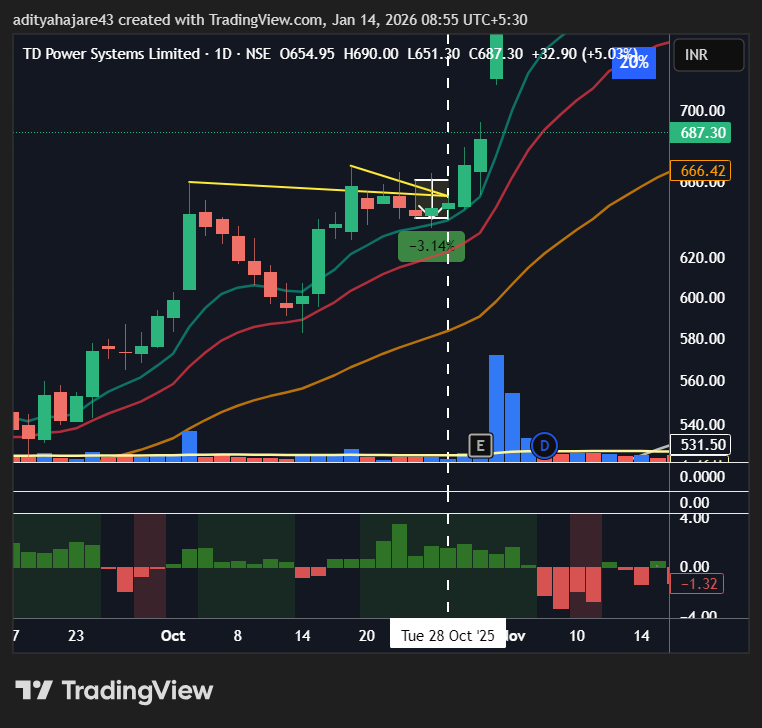
  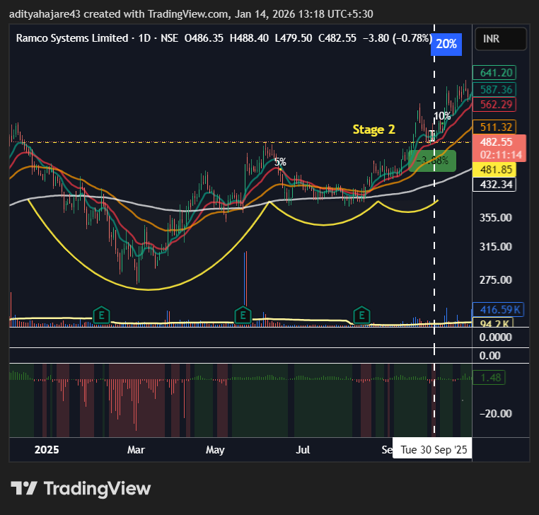
  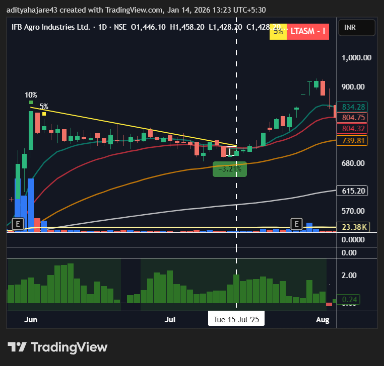
  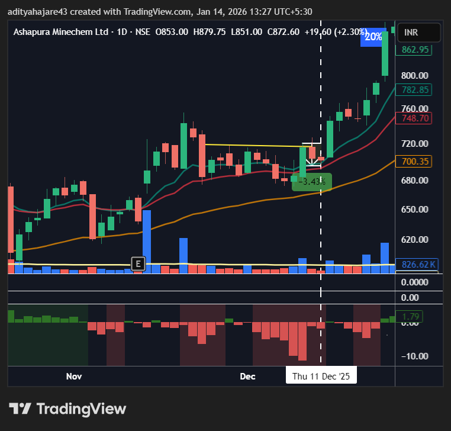
  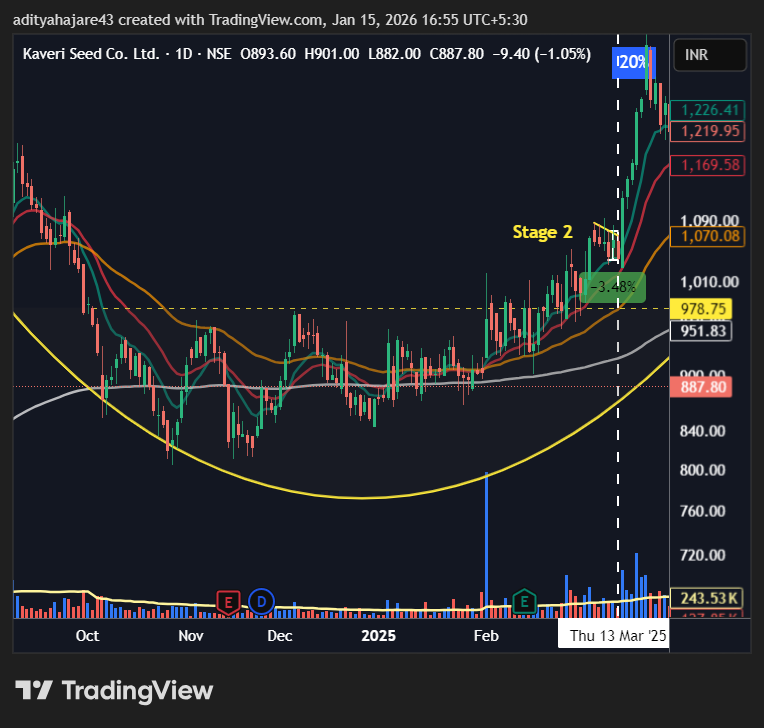
  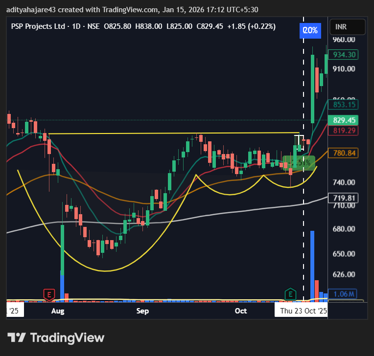
  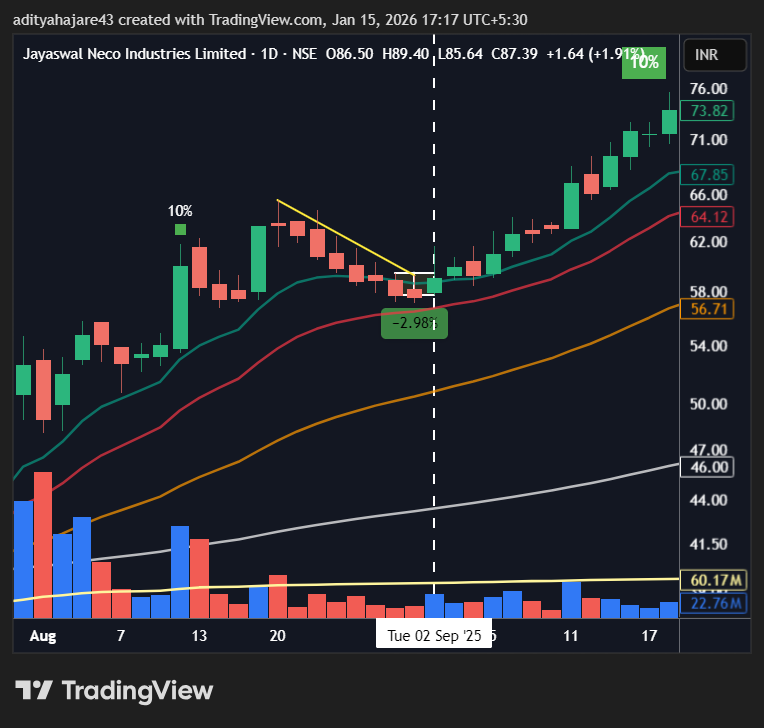
  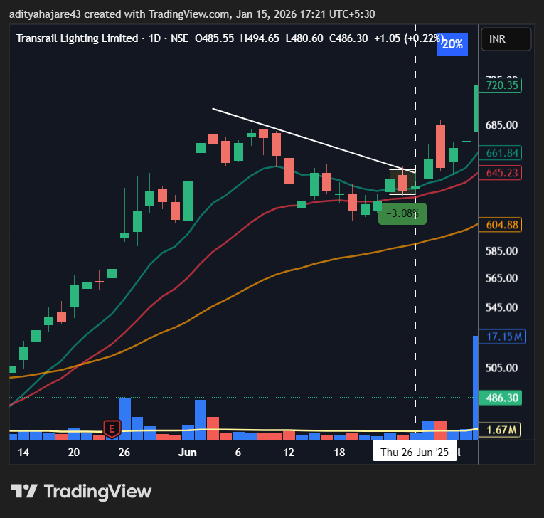
  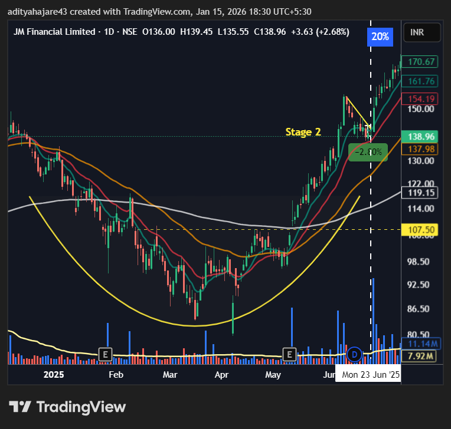
  
  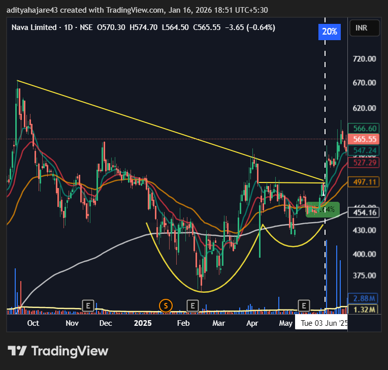
  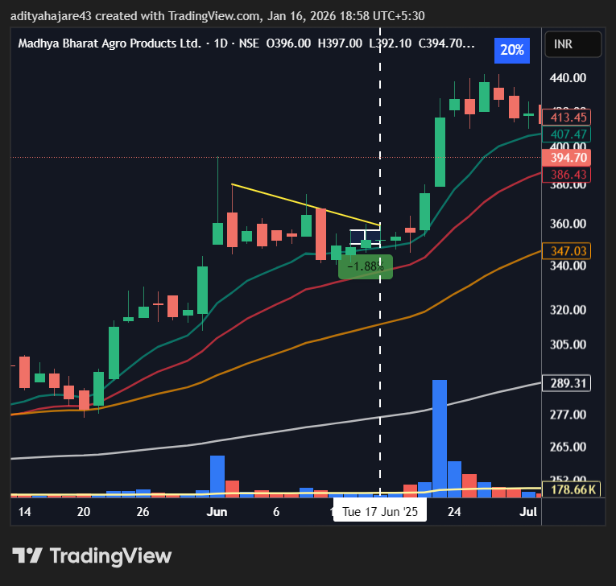
  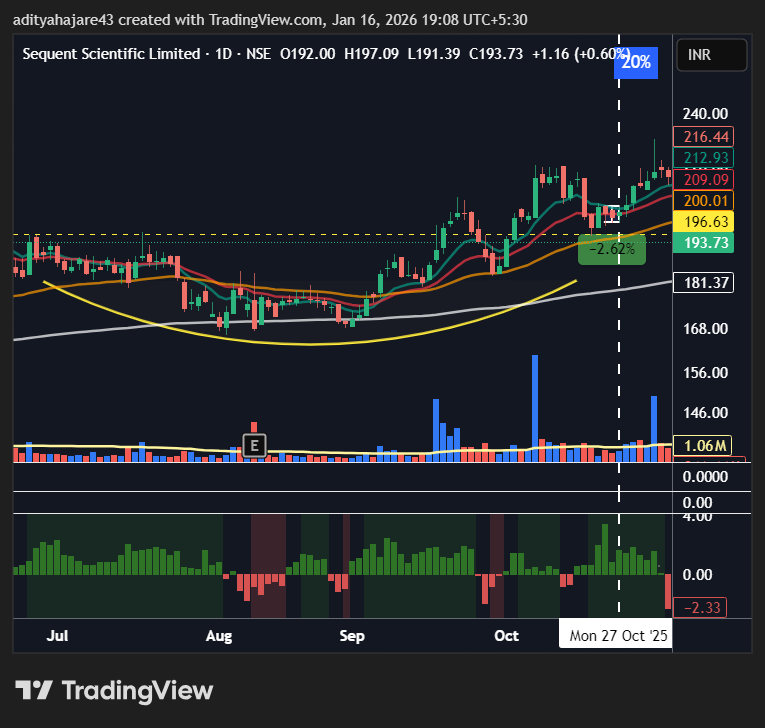
  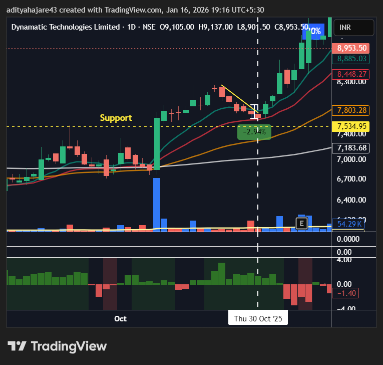
  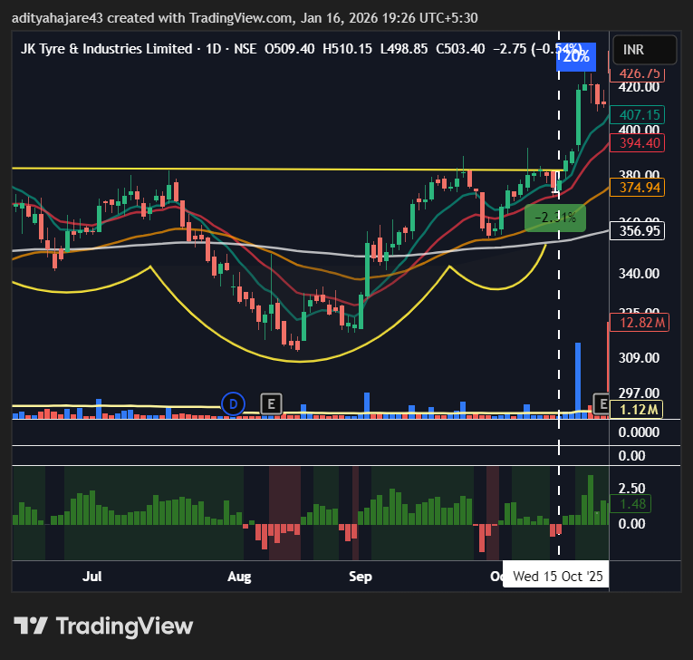

