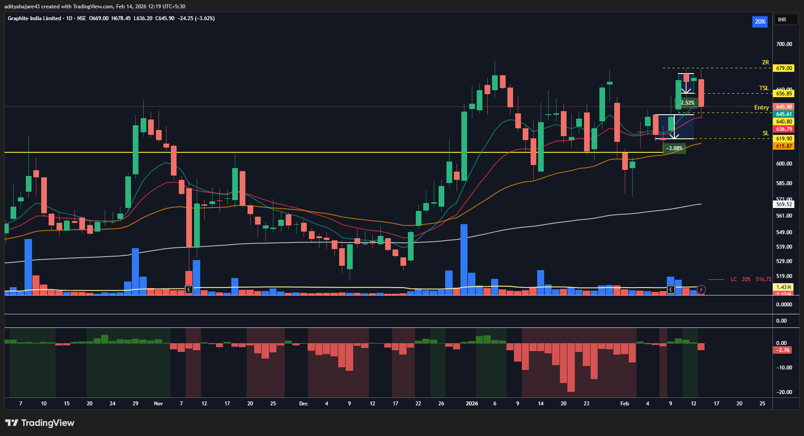
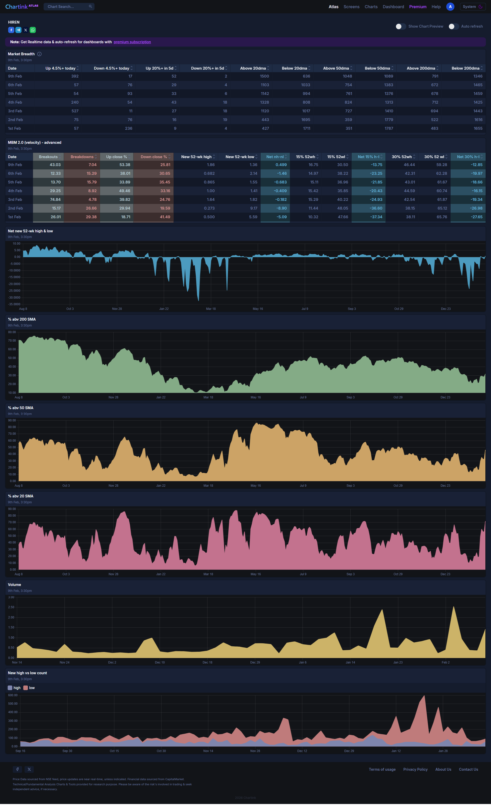

## GRAPHITE - 10 February 2026
- **Entry Date:** 10 February 2026
- **Exit Date:** 13 February 2026
- **Exit Reason:** Trailing SL Hit
- **Pivot Type:** 3 Candle
- **Buy Price (Actual):** 640.803
- **Quantity:** 155
- **Sell Price (Actual):** 655.264
- **P/L (Actual):** +2.2567%

----

## Trade Management Updates
- *[13 Feb 2026] Trailing SL Hit. Market breadth also became very weak confirming this is still a choppy market.*
- *[12 Feb 2026] SL Moved to new 3-Candle Pivot low. Reasons: Market breadth looking weak and a new 3-Candle Pivot formed.*
- *[09 Feb 2026] GTT Placed. Market Breadth looks good. Catalyst: India - US Trade Deal News.*

----

## Exit (Trailing SL Hit):

----

## Entry Setup:

----

## Market Breadth on 09 February 2026:
