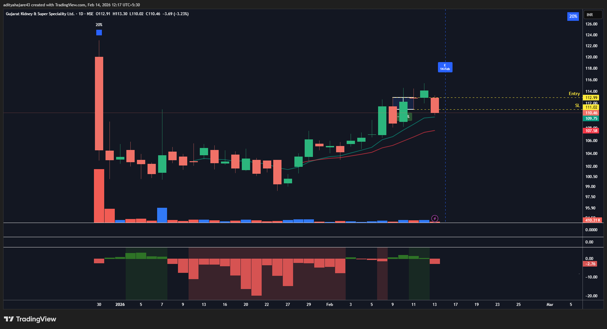
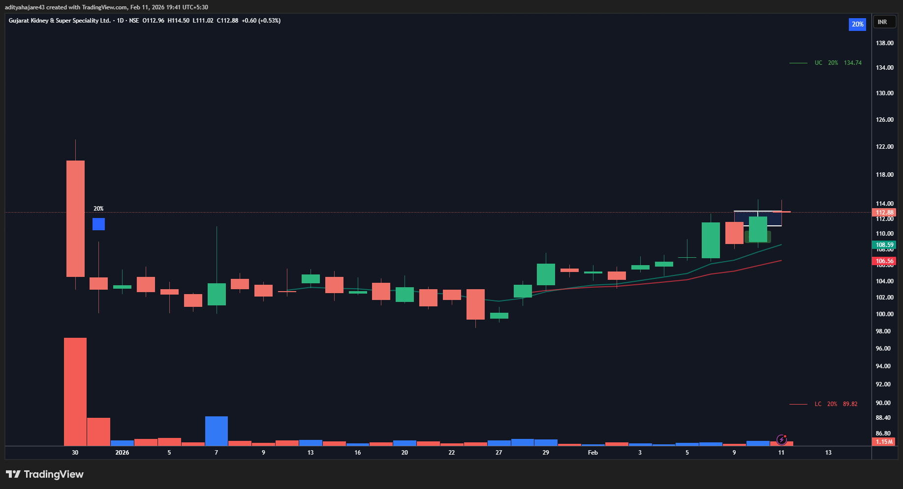
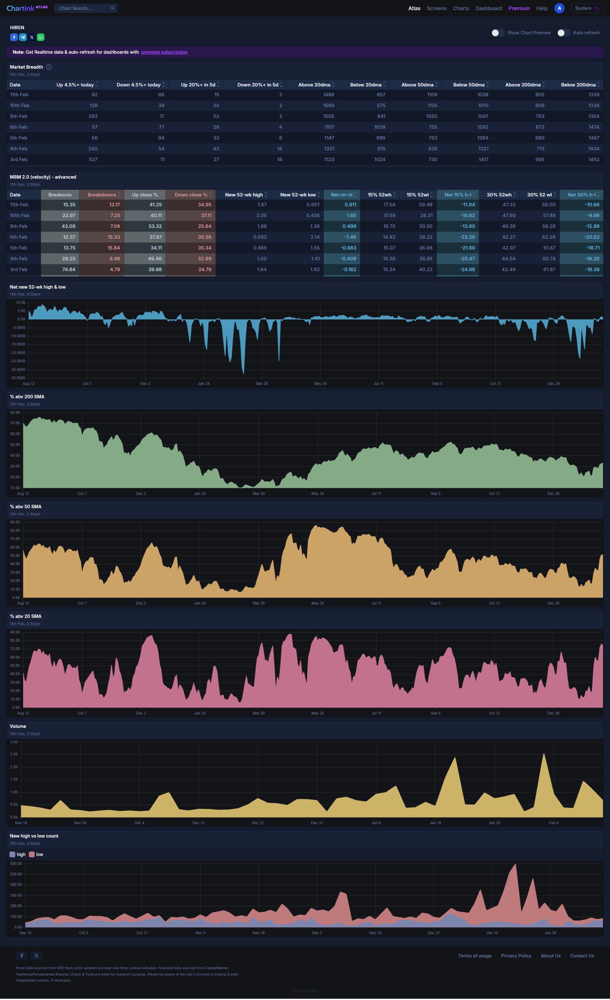

## GKSL - 12 February 2026 (IPO Setup)
- **Entry Date:** 12 February 2026
- **Exit Date:** 13 February 2026
- **Exit Reason:** SL Hit
- **Pivot Type:** 3 Candle
- **Buy Price (Actual):** 113.849
- **Quantity:** 876
- **Sell Price (Actual):** 110.653
- **P/L (Actual):** -2.80723%

----

## Exit (SL Hit):

----

## Entry Setup:

----

## Market Breadth on 11 February 2026:
