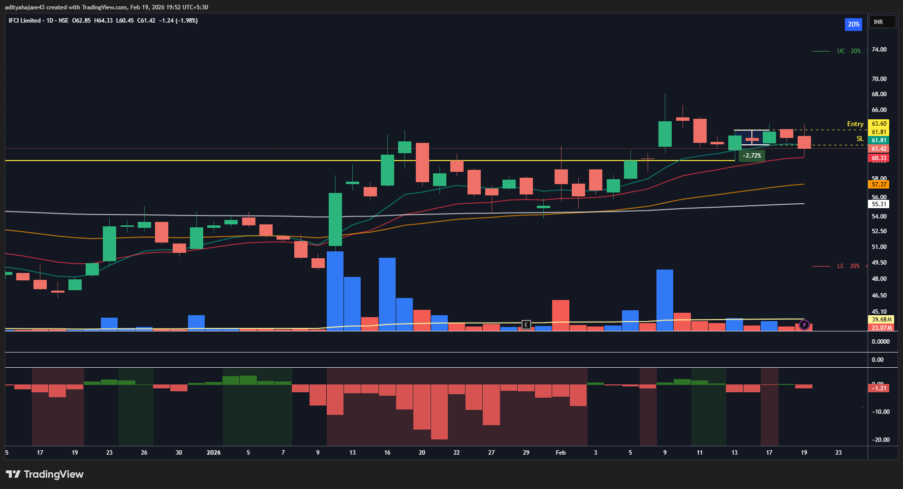

## IFCI - 18 February 2026
- **Entry Date:** 18 February 2026
- **Exit Date:** 19 February 2026
- **Exit Reason:** SL Hit
- **Pivot Type:** 3 Candle
- **Buy Price (Actual):** 63.60
- **Quantity:** 1558
- **Sell Price (Actual):** 61.81
- **P/L (Actual):** -2.81%

----

## Trade Management Updates
- ***[19 Feb 2026]** SL Hit. Market breadth continues to become weaker and weaker. Majority of the breakouts are also falling back to bases or hitting SLs.*
- ***[18 Feb 2026]** Entry triggered.*
- ***[17 Feb 2026]** GTT Placed. Market breadth seems to recover with good thrust coming back into rally. NNH-NNL criteria not met (-0.04). Used Buy Limit Price With 0.5% Slippage.*

----

## Exit (SL Hit):

----

## Entry Setup:

----

## Market Breadth on 11 February 2026:
