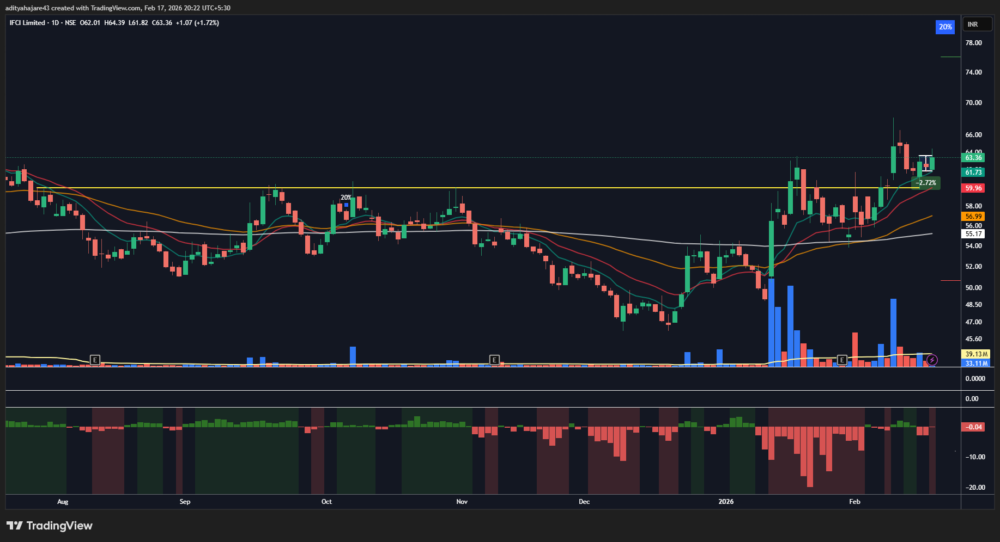
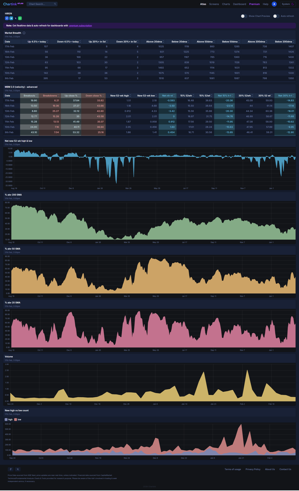

## IFCI - 18 February 2026
- **Entry Date:** 18 February 2026
- **Exit Date:**
- **Exit Reason:**
- **Pivot Type:** 3 Candle
- **Buy Price (Actual):** 63.60
- **Quantity:** 1558
- **Sell Price (Actual):**
- **P/L (Actual):**

----

## Trade Management Updates
- *[18 Feb 2026] Entry triggered.*
- *[17 Feb 2026] GTT Placed. Market breadth seems to recover with good thrust coming back into rally. NNH-NNL criteria not met (-0.04). Used Buy Limit Price With 0.5% Slippage.*

----

## Entry Setup:

----

## Market Breadth on 11 February 2026:
